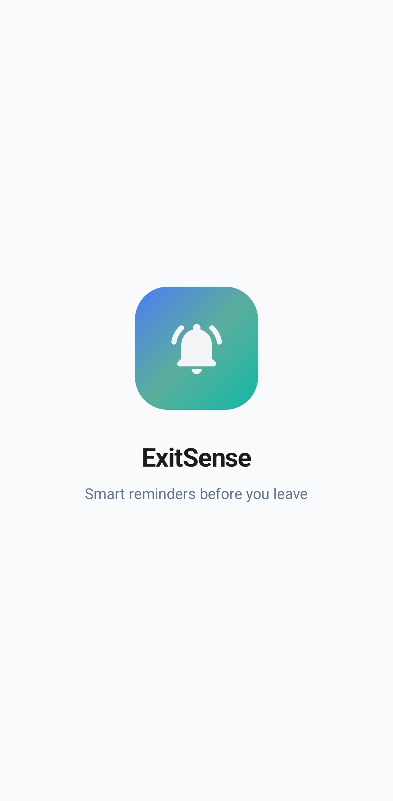
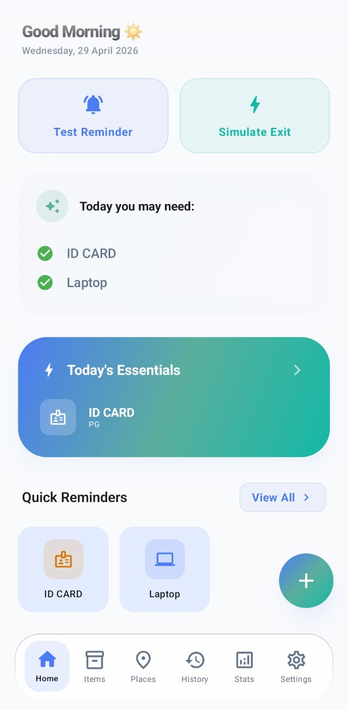
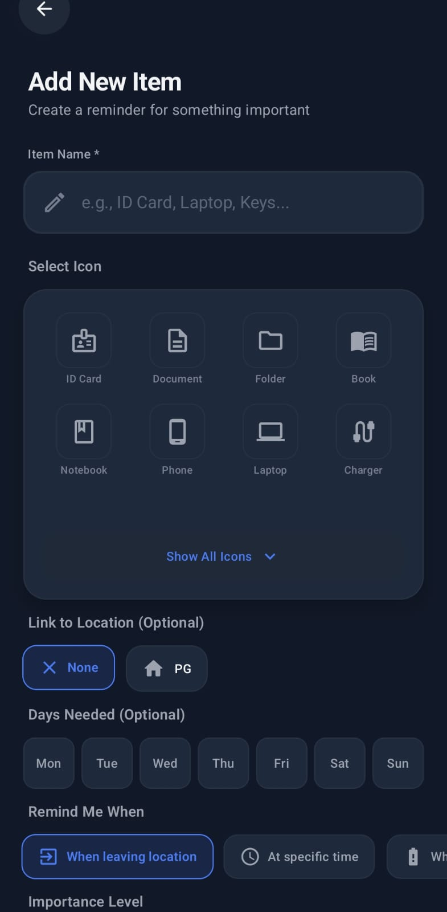
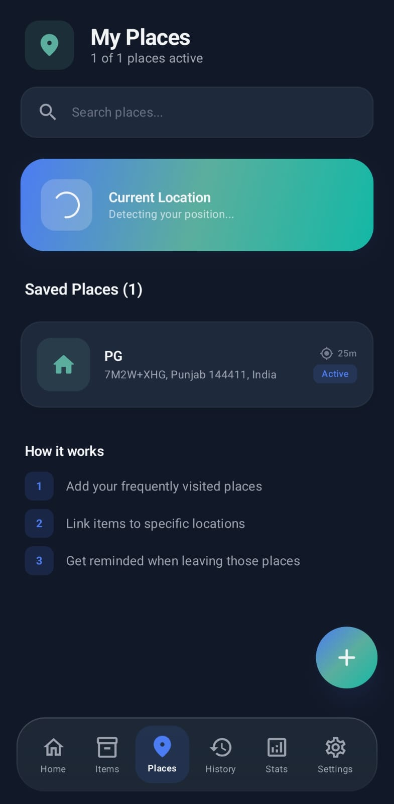
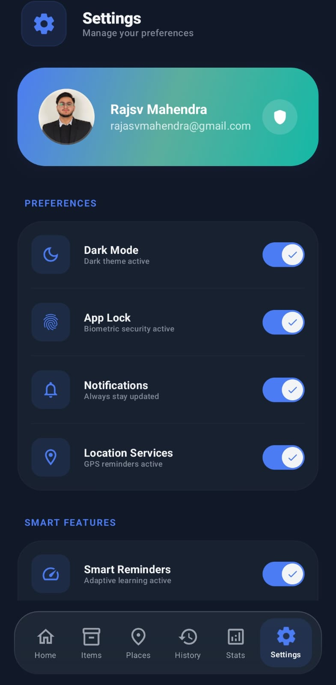

<p align="center">
  
</p>

<h1 align="center">ExitSense</h1>

<p align="center">
  <b>🔔 Smart Reminders Before You Leave</b>
</p>

<p align="center">
  A premium Android productivity app that helps users remember important essentials before leaving home, hostel, college, or office.
</p>

<p align="center">
  <a href="https://github.com/rajsvmahendra/ExitSense/releases/latest">📦 Download APK</a>
  &nbsp;•&nbsp;
  <a href="https://github.com/rajsvmahendra/ExitSense">💻 Source Code</a>
</p>

---

## 📌 Overview

**ExitSense** is a smart reminder application designed to help users avoid forgetting everyday essentials such as:

- 🎫 ID Card  
- 👛 Wallet  
- 🔌 Charger  
- 💻 Laptop  
- 🔑 Keys  
- 📄 Documents  
- 💧 Water Bottle  

The app intelligently connects **items + places + reminders** so users receive alerts before leaving locations like:

- 🏠 Home  
- 🏢 Office  
- 🎓 College  
- 🛏 Hostel  
- 📚 Library  

---

## ✨ Key Features

### 🔔 Smart Reminders
Get timely alerts before leaving saved places.

### 📍 Location-Based Detection
Save places and receive reminders based on where you are.

### 🎒 Item Management
Create, edit, pin, delete, and organize essentials.

### 📊 Statistics Dashboard
Track saved items, places, streaks, and productivity insights.

### 🔐 App Lock Security
Biometric fingerprint protection for privacy.

### ☁️ Google Sign-In
Fast and secure Firebase authentication.

### 🌙 Light / Dark Theme
Beautiful premium experience in both modes.

### 🎨 Premium UI
Modern glassmorphism design with smooth animations.

---

## 📸 Screenshots

<p align="center">
  
  
</p>

<p align="center">
  
  
</p>

---

## 🛠 Tech Stack

| Category | Technology |
|----------|------------|
| 💻 Language | Kotlin |
| 🎨 UI | Jetpack Compose |
| 🧱 Design | Material 3 |
| 🏗 Architecture | MVVM |
| 🔐 Authentication | Firebase Google Sign-In |
| 💾 Storage | DataStore |
| 🗄 Database | Room |
| ⚙ Background Tasks | WorkManager |
| 📍 Location | Google Play Services |
| 🧭 Navigation | Navigation Compose |

---

## 🧠 Architecture

ExitSense follows **MVVM Architecture**:

- **Model** → Repositories and data layer  
- **View** → Jetpack Compose screens  
- **ViewModel** → UI state and business logic  

This keeps the project scalable, clean, and maintainable.

---

## 🚀 Installation

### 📦 Download APK

👉 [Latest Release](https://github.com/rajsvmahendra/ExitSense/releases/latest)

### 💻 Run Locally

```bash
git clone https://github.com/rajsvmahendra/ExitSense.git
````

Open in **Android Studio** and run on emulator or device.

---

## 🔒 Permissions Used

* 🔔 Notifications
* 📍 Fine Location
* 📍 Coarse Location
* 👆 Biometric Authentication

Used only for core app functionality.

---

## 📈 Current Release

**v1.1.1**

Includes:

* 📊 Better statistics system
* 🎨 UI refinements
* ⚙ Improved settings
* 🔐 Stable authentication
* 🚀 Performance improvements

---

## 🔮 Future Improvements

* ☁️ Cloud sync across devices
* ⌚ Wear OS support
* 🤖 AI habit suggestions
* 💾 Backup / Restore
* 🧩 Home screen widgets

---

## 👨‍💻 Developer

**Rajsv Mahendra**

🌐 GitHub: [https://github.com/rajsvmahendra](https://github.com/rajsvmahendra)

---

## ⭐ Support

If you like this project, consider giving it a **star** on GitHub.

---

## 📄 License

This project is for educational and portfolio purposes.

